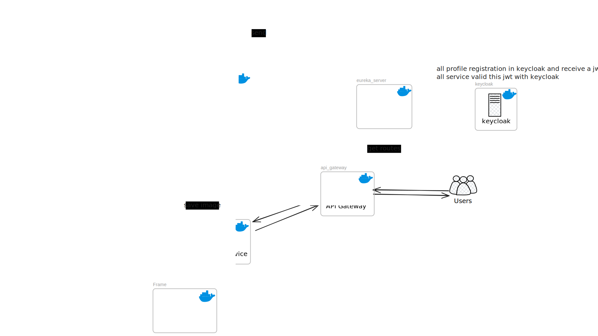

# WebShops

**WebShops** — это микросервисное приложение электронной коммерции, разработанное с использованием Spring Boot и Java 17. Архитектура проекта основана на модульном подходе с отдельными сервисами для пользователей, аутентификации, товаров, корзины, уведомлений и API-шлюза.

## 🧩 Модули проекта

- **[api-gateway](api-gateway/Readme.md)** — шлюз для маршрутизации запросов между сервисами.
- **[profile-service](core/profile-service/Readme.md)** — управление профилями пользователей.
- **[catalog-service](core/catalog-service/Readme.md)** — каталог товаров, категории, поиск.
- **cart-service** — корзина пользователя и управление покупками.
- **notification-service** — отправка уведомлений (email, push и т.д.).
- **[discovery-server](common/discovery-server/Readme.md)** — Service Discovery Eureka.

## ⚙️ Технологии

- Java 17
- Spring Boot 3.5.3
- Spring WebFlux
- Spring Security (OAuth2 / JWT)
- REST API
- R2DBC
- Keycloak
- Maven
- React
- Docker 
- Microservices

## 📂 Структура проекта

```
WebShops/
├───api-gateway
├───assets
├───common
│   ├───analytics-service
│   ├───discovery-server
│   └───notification-service
├───core
│   ├───cart-service
│   ├───catalog-service
│   ├───order-service
│   ├───payments-service
│   └───profile-service
└───devops
    └───docker
```

## 🌐 Диаграмма проекта
На текущий момент состояние проекта отображено на диаграмме

!
## 🚀 Запуск проекта

1. Склонируйте репозиторий:

   ```bash
   git clone https://github.com/faketri33/web-shop-microservice
   cd web-shop-microservice
   mvn clean package
   cd devops/docker/utils
   docker-compose --env-file ../../../env/docker.env -f docker-compose.yml -f docker-compose.database.yml -f docker-compose.tools.yml -f docker-compose.backend.yml --profile database --profile tools --profile backend up -d
